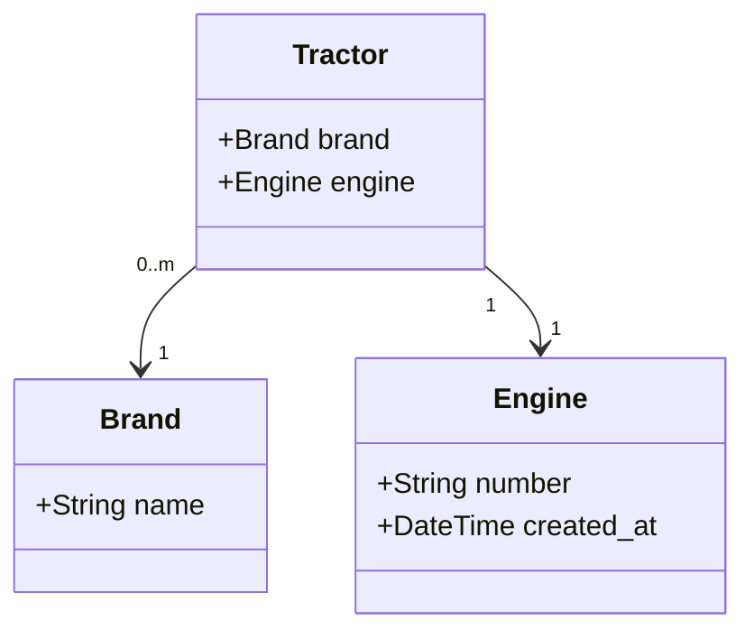

# Custom Actions
You can define a custom action with the `configureActions()`-method. 
In this example we will clone an entity with its relations.
That way you should get a good understanding of how you can implement custom actions.

Inside your `Definition` you can override the `configureActions()`-method like this:
```PHP
public function configureActions(mixed $data): void {
    parent::configureActions($data);

    if ($data) {
        $this->addAction('clone', [
            'label' => 'app.actions.clone',
            'icon' => 'back',
            'visibility' => [Page::SHOW],
            'route' => static::getRoute(Page::CREATE),
            'route_parameters' => [
                'clone' => $data->getId(),
            ],
        ]);
    }
}
```

This tells the crud bundle to create a button in the top bar with the identifier `clone`.
It will have the bootstrap icon called `back` and only shows up if the current view has the type `Page::SHOW`.
If you click on this button, it will redirect the user to the route defined for `Page::CREATE` and set the parameter `clone` to the id of the current item.
Speaking in terms of methods in a class, the click of the button will evoke the `createEntity()`-method, which we can override.

## Cloning Entities
In order to clone our entities, we override the `createEntity()`-method in our Definition like so:
```PHP
public function createEntity(Request $request): mixed {
    if ($request->query->has('clone')
        && ($cloneTractor = $this->getRepository()->find($request->query->getInt('clone')))) {
        /** @var Tractor $clone */
        $clone = clone $cloneTractor;

        return $clone;
    }

    return parent::createEntity($request);
}
```

When it comes to the actual cloning itself, we want to implement the `__clone()`-method on all entities we want to create from scratch.
Let's suppose we have a project with the following entities:

For the sake of this example, we want to have only one brand-instance per brand. 
But in order to have a fully assembled tractor in the end, we do want an engine for each of them.

That means we are going to override the `__clone()`-method in the Engine-Entity as follows:
```PHP
public function __clone(): void {
    $this->id = null;
    $this->created_at = new DateTime();
}
```
In order to properly set the `created_at` field we override it with the current date and time.
Since we set the `id` to `null`, Doctrine will create a new database entry for this Entity.

In the Brand class we will not set the id to null, because we don't want a duplicate brand in the database.
