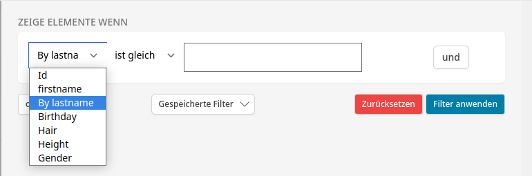
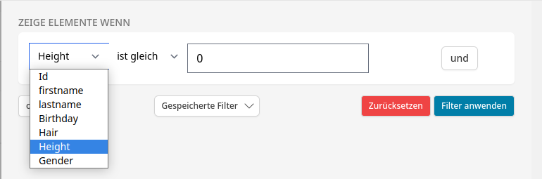
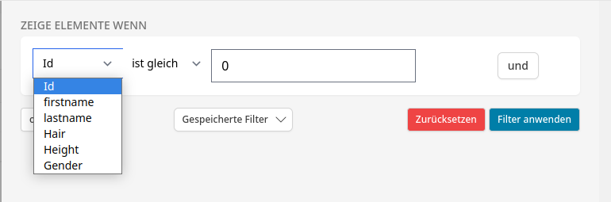

# Filters

Filters can be defined inside a `Definition`.

## Default behaviour

Whenever you create a `Definition` it will create some filters for you.
Out of the box the filters are defined by the properties of the `Entity`.
If this behaviour does not fit your needs properly, you can always override the `configureFilters()`-method to [change the labels](#how-to-override-filter-label), [create custom filters](#how-to-add-a-custom-filter) or [remove auto-generated ones](#how-to-remove-an-unwanted-filter). You can also allow the user to [select some predefined filters](#how-to-predefine-often-used-filters).

ℹ️ Note that you don't necessarily have to call `parent::configureFilters($table)` when you override the `configureFilters`-method. But you will only get the auto-generated filters if you do. Having them generated by the TableBundle will improve the readability of your code. That's why we highly recommend using it.

## How to override filter label

The bundle tries to detect labels automatically, you can however override the generated labels very easily:

```php
public function configureFilters(Table $table)
{
    parent::configureFilters($table);
    $table->getFilterExtension()
        ->overrideFilterName('lastname', 'By lastname');
    // overrideFilterName(acronym, new label value)
}
```

### Result


## How to add a custom filter

The bundle tries to detect labels automatically, you can however override the generated labels easily:

```php
public function configureFilters(Table $table)
{
    parent::configureFilters($table);
    $table->getFilterExtension()
        ->addFilter('age', 'Age', new NumberFilterType(self::getQueryAlias() . '.age'));
    // addFilter(acronym, label, FilterType)
}
```

### Result


## How to remove an unwanted filter
You can also remove filters that have been auto-generated:

```php
public function configureFilters(Table $table)
{
    parent::configureFilters($table);
    $table->getFilterExtension()
        ->removeFilter('birthday');
    // removeFilter(acronym)
}
```

### Result


## How to predefine often used filters
Sometimes you have filters or a set of filters that you use pretty often. Instead of always clicking them together in the UI, you can predefine them via code and make them available to all users:

(For instance we often search for users with blonde hair, a height of at least 180cm and only persons that identify as women)

```php
public function configureFilters(Table $table)
{
    parent::configureFilters($table);
    $table->getFilterExtension()
        ->predefineFilter('custom_query', 'hair', TextFilterType::CRITERIA_EQUAL, HairColorEnum::BLONDE)
        ->and('height', NumberFilterType::CRITERIA_BIGGER_THAN, 180)
        ->and('gender', TextFilterType::CRITERIA_EQUAL, GenderEnum::WOMAN)
    ->end();
    // predefineFilter(acronym, label, operator, value)
}
```
It is now possible to open http://[domain].[tld]/[your-site-with-the-table]?[table-identifier]_filter_predefined=custom_query and the declared filters will be applied.

---

🔗 For more infos on filters or the TableBundle, take a look into the [documentation](https://whatwedo.github.io/TableBundle).
